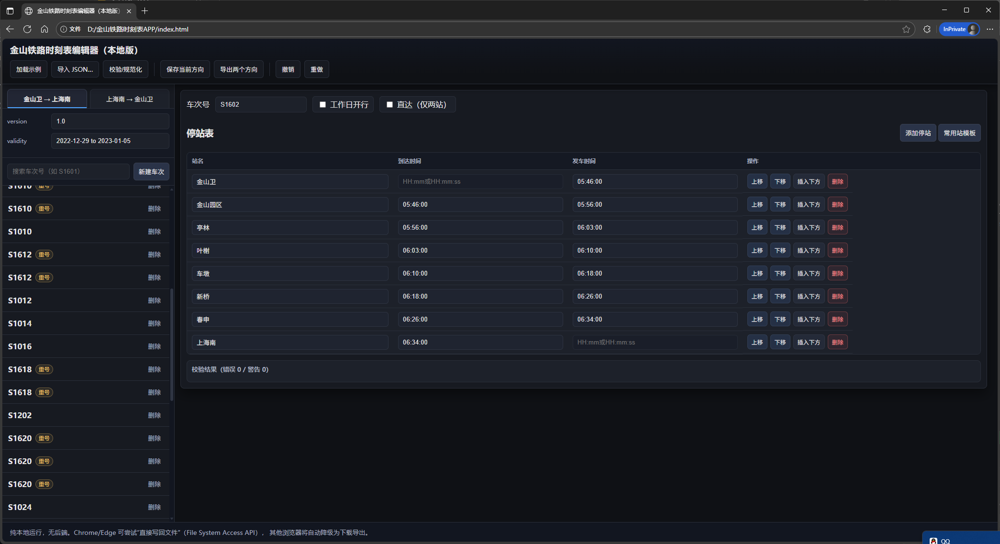

# 金山铁路时刻表编辑器（本地版）

一个纯前端、离线可用的金山铁路时刻表 JSON 编辑器。无需后端服务，直接在浏览器中导入/编辑/校验并导出两个方向的时刻表数据。

- 预览文件：`index.html`
- 主要脚本：`app.js`
- 样式文件：`styles.css`
- 示例数据：`金山卫-上海南.json`、`上海南-金山卫.json`
- 可选参考：`UI参考.png`、`金山铁路时刻表.pdf`

---

## 功能特性

- 双方向数据集（A：金山卫 → 上海南；B：上海南 → 金山卫），可在左侧 TAB 切换
- 导入本地数据、加载示例、编辑元数据（version、validity）
- 新建/删除车次，编辑车次号、是否“工作日开行”、是否“直达（仅两站）”
- 停站表行的增删改、上下移动、拖拽排序
- 时间输入支持宽松解析与规范化（自动补秒为 HH:mm:ss）；首站到达固定为 null、末站发车固定为 null
- 校验面板给出错误/警告，如时间倒序、格式不正确、直达时站数限制等
- 撤销/重做（Ctrl/⌘+Z、Ctrl/⌘+Y 或 Ctrl/⌘+Shift+Z）
- 保存当前方向或分别导出两个方向的 JSON
- Chrome/Edge 支持通过 File System Access API 直接写回文件；其他浏览器自动降级为下载

---

## 目录结构

- `index.html` 前端页面（引用 dayjs 与解析插件）
- `app.js` 业务逻辑（状态管理、渲染、校验、导入导出、撤销重做等）
- `styles.css` 页面样式（深色主题，滚动条定制）
- `金山卫-上海南.json` 示例数据（方向 A）
- `上海南-金山卫.json` 示例数据（方向 B）

---

## 使用说明

示例图

左侧面板
- Tabs：切换 A/B 方向
- Meta：编辑 `version`、`validity`
- 搜索框：按车次号过滤列表（大小写不敏感）
- “新建车次”：自动以当前方向的端点作为首末站
- 列表项：显示车次号与标签（直达/工作日/重号），可点击选中或删除

右侧编辑器
- 顶部字段：车次号、工作日开行、直达（仅两站）
- 停站表：
  - 增加停站：在末站前插入
  - 常用站模板：按方向快速填充固定站序（端点固定，中间站清空时间）
  - 行支持拖拽、上移/下移、插入下方、删除
  - 首站“到达”固定禁用且为 null；末站“发车”固定禁用且为 null
  - 时间输入支持 `HH:mm` 或 `HH:mm:ss`（会补齐为 `HH:mm:ss`）；`nan`/空白会被清理为 null
- 校验/规范化：
  - 点击“校验/规范化”会同步未失焦输入，清理非法时间字符串，强制首末约束，并在面板显示错误/警告
  - 直达开关：若非两站会提示是否自动压缩为首末两站

保存与导出
- “保存当前方向”：保存当前 TAB 所在方向的数据为 JSON
- “导出两个方向”：分别生成两个 JSON 下载/保存
- Chrome/Edge 等支持 File System Access API 时，会出现系统保存对话框并记住文件句柄，后续可直接覆盖保存；若不支持或用户取消，则自动降级为下载

键盘快捷键
- 保存：Ctrl/⌘ + S
- 撤销：Ctrl/⌘ + Z
- 重做：Ctrl/⌘ + Y 或 Ctrl/⌘ + Shift + Z

---

## 数据模型

JSON 结构（保存/导出时的字段顺序与缩进保持一致）：
```json
{
  "version": "1.0",
  "validity": "2023-01-01 to 2023-12-31",
  "trains": [
    {
      "trainNumber": "S1601",
      "isWeekdayOnly": true,
      "stops": [
        { "stationName": "金山卫", "arrivalTime": null, "departureTime": "06:30:00" },
        { "stationName": "上海南", "arrivalTime": "07:30:00", "departureTime": null }
      ],
      "isDirect": false
    }
  ]
}
```

规范化与校验要点
- 时间字符串：
  - 接受 `HH:mm` / `H:mm` / `HH:mm:ss` / `H:mm:ss`，保存前统一转为 `HH:mm:ss`
  - `nan`、空字符串、仅空白会被转为 `null`
- 首末规则：首站 `arrivalTime = null`，末站 `departureTime = null`
- 直达规则：直达车次仅允许两站
- 顺序规则：同站到达不得晚于发车；跨站上站发车不得晚于下站到达
- 站名必填；中间站“仅到/仅发”允许但会给出警告
- 宽松解析时若数值越界（小时 0–23，分/秒 0–59）会提示警告

---

## 临时存储与持久化

- 内存状态（会话内）：
  - `state` 保存 A/B 数据、当前索引、撤销/重做栈（`history`/`future`）与当次文件句柄
  - 页面刷新/关闭后，这些“即时临时存储”都会丢失
- 浏览器 `localStorage`（跨会话、同源）：
  - 键名：`timetable_state_v1`
  - 内容：`{ A, B, currentDir, currentIndex }`
  - 不保存：撤销/重做栈、文件句柄
  - 初始化时自动恢复；写入失败（配额/隐私模式等）会静默忽略
- 文件持久化（最终）：
  - 优先 File System Access API（Chrome/Edge，需安全上下文：HTTPS 或 localhost）
  - 不支持/被拒绝时，降级为下载保存

风险提示
- 仅在输入框“失焦”或执行按钮操作时，才会将最新修改同步并写入 `localStorage`
- 如果编辑后立即关闭页面，且未触发失焦/同步动作，可能只停留在内存层并丢失

---

## 浏览器兼容性与权限

- Chrome/Edge：完整支持，推荐通过本地 HTTP 服务访问页面（安全上下文）
- Safari/Firefox：不支持 File System Access API，保存会以下载形式进行
- 在 `file://` 打开时，“加载示例”可能因浏览器安全策略失败；改用“导入数据…”或本地 HTTP 服务

---

## 依赖

- [dayjs](https://day.js.org/) + `customParseFormat` 插件（通过 CDN 引入，仅用于时间解析与格式化）

---

## 开发

- 本项目为纯静态网页，无构建步骤与后端依赖
- 代码组织：
  - `app.js`：状态管理、渲染、事件绑定、校验与规范化、保存/导入导出
  - `styles.css`：深色主题样式与滚动条定制
  - `index.html`：页面结构与依赖引入
